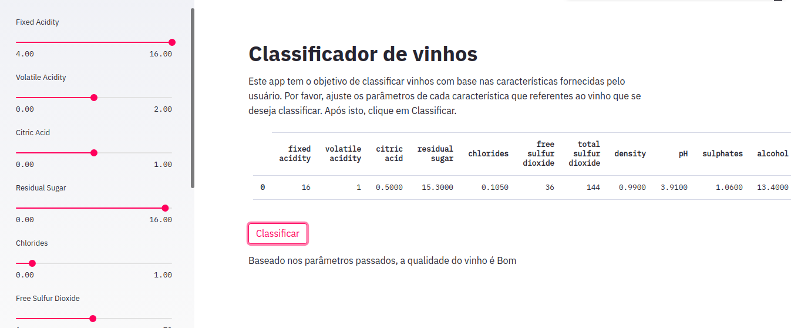

# Classificador de vinhos com o PyCaret
Criando um classificador de vinhos utilizando o PyCaret, uma biblioteca para machine learning que permite construir modelos de aprendizado de máquina com poucas linhas de código. Também foi utilizado o Streamlit para tornar nosso nodelo em uma aplicação final e pronta para o uso.

## Instalando as bibliotecas
Para instalar as dependências utilize o comando abaixo:

    pip install -r requirements.txt

## Fontes
Tutorial criado com base no material disponível em [Towards Data Science](https://towardsdatascience.com/pycaret-and-streamlit-how-to-create-and-deploy-data-science-web-app-273d205271a3)